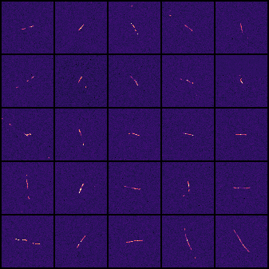

# cosmic-ray-detector

Use your DSLR to detect cosmic rays!

This repo is a little messy, there's a lot of ad hoc junk. Please don't hesitate to reach out if you have any questions, you can find my contacts [here](https://bithole.dev/).

**!!! WARNING: IF YOUR SYSTEM USES FORWARD SLAHSES MAKE SURE TO CHANGE THE VALUE IN `extract-clusters.js` !!!**
